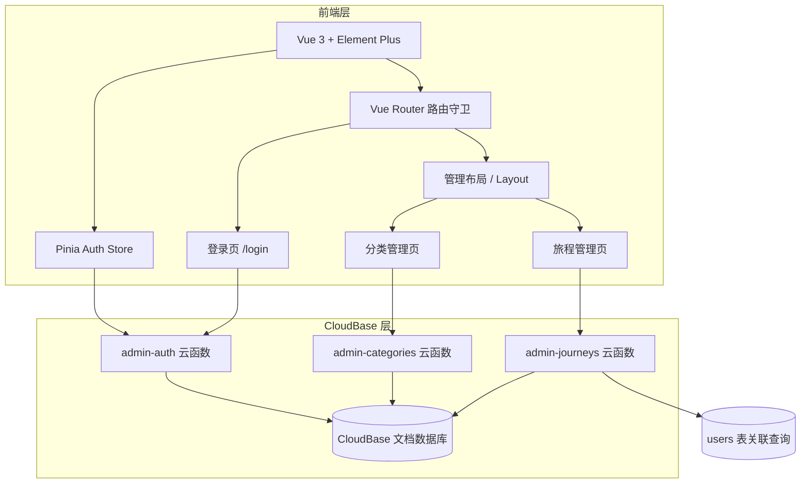

## 产品概述

在空白 `background/` 目录下从零搭建 Mapory（旅行记忆）后台管理系统，基于 Vue 3 + Element Plus + 腾讯云开发（CloudBase）全栈架构。首个模块为日志管理，支持管理员登录后对所有用户的旅程数据进行管理。

## 核心功能

### 管理员登录

- CloudBase 自定义账号密码认证
- 登录态持久化（CloudBase auth ticket）
- 路由守卫拦截未登录用户

### 日志分类管理

- 分类列表页：表格展示分类名称、图标、排序序号、创建时间
- 新增分类：弹窗表单输入名称、图标、排序号
- 编辑分类：弹窗表单修改已有分类信息
- 删除分类：二次确认后删除，若有关联旅程则提示
- 分类数据关联到 journeys 集合的 category_id 字段

### 旅程基本信息维护

- 旅程列表页：分页表格展示所有用户的旅程，含序号、旅程名称、所属用户（昵称）、目的地、日期、标签、分类、状态
- 搜索筛选：按旅程名称关键词搜索、按分类下拉筛选、按状态（active/archived/deleted）筛选
- 旅程编辑：弹窗表单修改名称、城市、省份、日期、描述、分类、标签
- 旅程状态变更：行内快捷操作（归档/恢复/软删除）
- 空状态处理：无数据时显示引导提示

## 技术栈选型

| 层级 | 技术选型 | 说明 |
| --- | --- | --- |
| 前端框架 | Vue 3 + TypeScript | Composition API，类型安全 |
| 构建工具 | Vite 5 | 极速 HMR |
| UI组件库 | Element Plus 2.x | 企业级后台 UI |
| 路由 | Vue Router 4 | 嵌套路由 + 路由守卫 |
| 状态管理 | Pinia | Vue 3 官方推荐 |
| 后端服务 | CloudBase 云函数 | Node.js 18 运行时 |
| 数据库 | CloudBase 文档数据库 | NoSQL，类 MongoDB |
| 认证 | CloudBase 自定义登录 | ticket 机制 |
| HTTP 客户端 | 云函数 SDK 直接调用 | 无需 axios |


## 实现方案

### 整体架构策略

采用 **前端直连云函数** 的轻量全栈架构，不部署独立后端服务器。前端通过 `@cloudbase/js-sdk` 调用云函数，云函数内使用 `@cloudbase/node-sdk` 操作数据库。管理员认证使用 CloudBase 自定义登录机制（服务端生成 ticket，客户端 `auth.customAuthProvider().signIn(ticket)` 完成登录）。



### 数据库设计

在 database-schema.md 已有 13 个集合基础上，新增 2 个集合并为 journeys 集合新增字段：

**新增集合 `journey_categories`**：

```
字段：_id, name(分类名), icon(图标), sort_order(排序), created_at, updated_at
索引：sort_order
```

**新增集合 `admins`**：

```
字段：_id, username(用户名), password_hash(bcrypt哈希), role(角色), created_at
索引：username（唯一）
```

**journeys 集合新增字段**：

```
category_id: String  // 关联 journey_categories._id，可为空
```

### 云函数设计

| 云函数 | 核心功能 | 关键操作 |
| --- | --- | --- |
| `admin-auth` | 管理员登录 | 验证用户名密码 → bcrypt 比对 → 生成 CloudBase ticket |
| `admin-categories` | 分类 CRUD | type 参数区分 list/create/update/delete，校验删除安全性 |
| `admin-journeys` | 旅程管理 | list（分页+搜索+筛选+用户关联）、update（更新基本字段+分类+标签+状态） |


### 性能与安全

- **分页查询**：云函数内使用 `skip/limit`，列表页默认每页 20 条
- **关联查询**：journeys 列表通过 `user_id` 批量查询 `users` 表获取昵称，避免 N+1
- **鉴权校验**：每个云函数校验 `auth.openid` 对应的管理员身份
- **速率限制**：登录接口限制每秒 5 次调用

## 目录结构

```
background/
├── index.html                            # [NEW] Vite 入口 HTML
├── package.json                          # [NEW] 项目依赖配置（Vue 3, Element Plus, Vite, Pinia, Vue Router, @cloudbase/js-sdk）
├── vite.config.js                        # [NEW] Vite 配置（resolve alias, server proxy）
├── cloudbaserc.json                      # [NEW] CloudBase 部署配置（环境ID, 云函数目录）
├── database/
│   └── init-cloudbase.js                 # [NEW] CloudBase 数据库初始化脚本（创建集合、索引、预置分类数据、管理员种子数据）
├── cloudfunctions/
│   ├── admin-auth/
│   │   ├── index.js                      # [NEW] 管理员登录云函数（验证账号密码，返回 ticket）
│   │   └── package.json                  # [NEW] 云函数依赖（@cloudbase/node-sdk, bcryptjs）
│   ├── admin-categories/
│   │   ├── index.js                      # [NEW] 分类管理云函数（list/create/update/delete）
│   │   └── package.json                  # [NEW] 云函数依赖
│   └── admin-journeys/
│       ├── index.js                      # [NEW] 旅程管理云函数（list/search/filter/update）
│       └── package.json                  # [NEW] 云函数依赖
└── src/
    ├── main.js                           # [NEW] Vue 入口（注册 Element Plus, Router, Pinia, CloudBase）
    ├── App.vue                           # [NEW] 根组件（router-view）
    ├── router/
    │   └── index.js                      # [NEW] 路由配置（登录/布局/子路由）+ 路由守卫
    ├── stores/
    │   └── auth.js                       # [NEW] Pinia 认证状态管理（login/logout, CloudBase auth state）
    ├── api/
    │   └── cloudbase.js                  # [NEW] CloudBase SDK 初始化 + 云函数调用封装
    ├── views/
    │   ├── Login.vue                     # [NEW] 登录页（Element Plus 表单，用户名密码登录）
    │   ├── Layout.vue                    # [NEW] 管理布局（el-container + el-aside 侧边栏 + el-main 内容区）
    │   ├── Dashboard.vue                 # [NEW] 首页仪表盘（统计数据概览：旅程总数、分类数、用户数）
    │   ├── categories/
    │   │   └── CategoryManage.vue        # [NEW] 分类管理页（el-table + el-dialog CRUD）
    │   └── journeys/
    │       └── JourneyManage.vue         # [NEW] 旅程管理页（el-table 分页 + 搜索筛选 + 编辑弹窗）
    └── styles/
        └── global.css                    # [NEW] 全局样式（重置样式、布局变量）
```

## 关键代码结构

### CloudBase SDK 初始化（src/api/cloudbase.js）

```javascript
import cloudbase from '@cloudbase/js-sdk'
const app = cloudbase.init({ env: 'your-env-id' })
const auth = app.auth({ persistence: 'local' })
async function callFunction(name, data) {
  const res = await app.callFunction({ name, data })
  if (res.result.code !== 0) throw new Error(res.result.message)
  return res.result.data
}
```

### 云函数统一响应格式

```javascript
// 成功：{ code: 0, data: {...}, message: 'ok' }
// 失败：{ code: -1, data: null, message: '错误描述' }
```

### 路由守卫逻辑（src/router/index.js）

```
/beforeEach: 检查 CloudBase auth.hasLoginState()
- 未登录且目标非 /login → 重定向到 /login
- 已登录且目标为 /login → 重定向到 /dashboard
```

## 设计风格

采用 Element Plus 默认的轻量企业级后台风格，简洁专业。整体布局为经典左侧导航 + 右侧内容区域结构，配色以 Element Plus 默认蓝为主色调，保持与 Mapory 品牌色（#6366F1 靛蓝紫）的呼应。

### 登录页

全屏居中卡片式登录表单，左侧展示 Mapory Logo 和产品名称，右侧为用户名密码输入区。背景使用淡色渐变（#f0f2f5 → #e8eaed），卡片带轻微阴影。

### 管理布局

- **侧边栏（el-aside）**：深色背景（#304156），宽度 220px，顶部 Logo 区，菜单项含图标+文字，当前选中项高亮
- **顶部栏（el-header）**：白色背景，右侧显示管理员用户名 + 退出按钮
- **内容区（el-main）**：浅灰背景（#f0f2f5），包含面包屑导航 + 页面内容

### 分类管理页

- 顶部操作栏：左侧"新增分类"主按钮（蓝色），右侧总数统计
- 分类表格：序号、分类名称、图标、排序号、创建时间、操作列（编辑/删除按钮）
- 编辑弹窗：名称输入框、图标选择器、排序号数字输入

### 旅程管理页

- 顶部筛选栏：搜索输入框（旅程名称）、分类下拉选择、状态下拉选择（active/archived/deleted）、搜索按钮
- 旅程表格：序号、旅程名称（可点击查看详情）、所属用户（昵称+头像）、目的地、日期范围、标签（el-tag）、分类（el-tag 彩色）、状态（el-tag 不同颜色）、操作（编辑/归档/删除）
- 分页器：el-pagination 底部居中
- 编辑弹窗：旅程名称、城市、省份、开始/结束日期、描述、分类下拉、标签输入（el-tag 动态添加/删除）

### 首页仪表盘

- 三个统计卡片并排：旅程总数（蓝色）、分类总数（绿色）、用户总数（橙色），每个卡片含图标+数字+标签
- 下方预留扩展区域（后续数据洞察模块）

## Agent Extensions

### Integration: tcb（CloudBase）

- **用途**：部署云函数到 CloudBase、初始化数据库集合（journey_categories、admins）、为 journeys 集合新增 category_id 字段、上传数据库安全规则
- **预期成果**：CloudBase 环境就绪，4 个集合创建完成，3 个云函数部署上线，管理员账号写入 admins 集合

### SubAgent: code-explorer

- **用途**：在生成具体代码前，快速确认 database-schema.md 中最新的字段名称和索引设计，确保代码与 schema 完全对齐
- **预期成果**：确认字段名（如 journeys 中 tags 是数组还是独立表）、确认 users 表的 nickname 字段路径